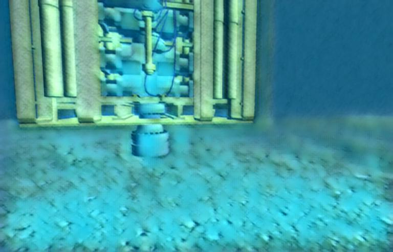

# Underwater Image Simulation

This ROS package aims to simulate the dusty and blurry conditions suffered in
underwater images due to light dispersion in such medium.

It was meant to be used with the underwater robotics simulator
[uuv_simulator](https://github.com/uuvsimulator/uuv_simulator),
which works on Gazebo, but it can be used with any image topic desired by the
user.

The technique used for creating this synthetic images is
[fast_neural_style](https://github.com/pytorch/examples/tree/master/fast_neural_style),
which mixes the style of an image with the content of another image. A model
has been trained to stylize the images as underwater images, which is then used
by this ROS package.

This package provides three operating modes:

- **ROS topic subscription and publishing**: subscribing to a published image topic,
stylizing of the incoming Image messages and then publishing the stylized image.
- **ROS bag file edition**: reading the desired message of a given bag file,
stylize such image message and then rewriting the bag with the stylized image.
- **Video frame stylizing**: stylize all the frames saved in a given folder.
This script is not ROS-dependant.

Hereafter each of the three operating modes will be described, and then examples
of stylized images with the given models will be shown.

## Setting up

First of all, the steps required to have this repository working in
your computer :)

Go to the `src` folder of your catkin workspace and clone this repository as:

```bash
git clone https://github.com/olayasturias/uw_img_sim
```

After that, in your catkin workspace build the project as:

```bash
catkin build uw_img_sim
```

Now you should be ready to use it!

## Running

As stated before, the three operation modes available are here described.

### ROS topic subscription and publishing


```bash
roslaunch uw_img_sim imtopicconvert.launch topic:=</image/topic> scale:=<scale>
model:=<model.model> cuda:=<cuda>
```

`topic`, `scale`, `model` and `cuda` are run-time ROS launch arguments:
/
-   `topic`: image topic to stylize.
-   `depth-topic`: topic with depth image. If not published, doesn't perform depth blurring
-   `scale`: factor for scaling down the content image, default: `2`.
-   `model`: model for image stylizing, default: `uw_turbid.model`.
-   `cuda`: set it to `1` for running on GPU, `0` for CPU.
-   `winsize`: size of Gaussian kernel that performs the depth blurring.
-   `attenuation`: attenuation and scattering parameter.
-   `alpha`: superposition between the original the stylized frame.
-   `nlights`: number of artificial lights to add. Default: `2`.
-   `light-pose`: position of the lights. Could be Bottom or Top and Left or Right.
Write two characters for each light indicating the position. Default: `BRBL`, corresponding to
Bottom Right and Bottom Left.

A topic will be published with the stylized image with the same name as the
input topic followed by `/underwater`.

### ROS bag file edition

```bash
roslaunch uw_img_sim bagconvert.launch topic:=</image/topic> scale:=<scale>
model:=<model.model> cuda:=<cuda> input-bag:=</path/to/input.bag>
output-bag:=</path/to/output.bag>
```

`topic`, `scale`, `model` and `cuda` are run-time ROS launch arguments:

/
-   `input-bag`: path to input bag file.
-   `output-bag`: path to output bag file.
-   `topic`: image topic to stylize.
-   `depth-topic`: topic with depth image. If not published, doesn't perform depth blurring.
-   `scale`: factor for scaling down the content image, default: `2`.
-   `model`: model for image stylizing, default: `uw_turbid.model`.
-   `cuda`: set it to `1` for running on GPU, `0` for CPU.
-   `winsize`: size of Gaussian kernel that performs the depth blurring.
-   `attenuation`: attenuation and scattering parameter.
-   `alpha`: superposition between the original the stylized frame.
-   `nlights`: number of artificial lights to add. Default: `2`.
-   `light-pose`: position of the lights. Could be Bottom or Top and Left or Right.
Write two characters for each light indicating the position. Default: `BRBL`, corresponding to
Bottom Right and Bottom Left.

A bag file will be saved with the same topics as the input bag, but with the
selected image topic stylized according to the chosen model.

### Video frame stylizing

This script is a python3 script instead of a ROS node, as it simply reads
image frames from a directory and stylizes them.

To run it, first go to the package directory:

```bash
cd src/uw_img_sim
```

And then run:

```bash
python3 convertframes.py eval -h
```
to see help about this script commands.

For example, for converting the example original frame to the stylized with the
blue style (and using the CPU), do:

```bash
python3 nodes/convertframes.py eval --content-image images/orig.jpg --model models/blue_water.model --output-image images/blue.jpg --cuda 0
```


## Examples of returned ouputs

Below there are some example of the returned output with the `uw_turbid.model`
, the `mediterranean.model` and the `cantabrico3.model`.
in the uuv simulator environment `subsea_bop_panel`. You can launch this model as:

```bash
roslaunch uuv_gazebo_worlds subsea_bop_panel.launch
```

On top, the original image from Gazebo, and below the stylized image with then
turbid (left) and the mediterranean (right) models.
<p align="center">
    
    
    
</p>

Hereafter, the atlantic and mediterranean modelled images after adding two artificial
lights on bottom right and left.

<p align="center">
    
    
    
</p>
